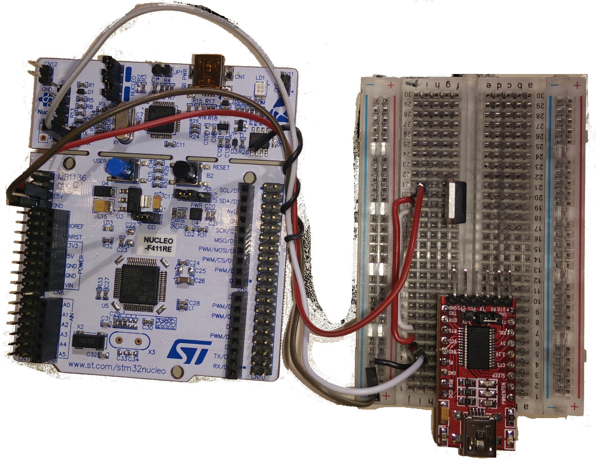

# Tool Introduction
This tool is designed to interface with a test to get the random numbers generated by the using a hash of a block of uninitialized SRAM.  In order to run the test a certain hardware setup is required due to the requirement to power off the DUT (device under test) for a certain time.

# Setup
## Required Tools
- DUT (a supported RIOT target board)
- USB to UART converter that supports setting the RTS pin and 5 volts (ie. [FT232RL board](https://www.amazon.de/dp/B00Q6WRLRG/ref=asc_df_B00Q6WRLRG52987430/?tag=googshopde-21&creative=22398&creativeASIN=B00Q6WRLRG&linkCode=df0&hvadid=214514261405&hvpos=1o3&hvnetw=g&hvrand=12687331247871878884&hvpone=&hvptwo=&hvqmt=&hvdev=c&hvdvcmdl=&hvlocint=&hvlocphy=9043485&hvtargid=pla-423147071511&th=1&psc=1))
- MOSFET to control power to the DUT (ie. [p16nf06l](http://www.st.com/content/ccc/resource/technical/document/datasheet/ca/9a/86/cf/24/84/4f/34/CD00003405.pdf/files/CD00003405.pdf/jcr:content/translations/en.CD00003405.pdf))
- Jumper cables
- Solderless breadboard

## Wiring
1. RTS <--> MOSTFET gate pin (FT232RL RTS - p16nf06l 1)
2. +5V <--> MOSTFET drain pin (FT232RL 5V - p16nf06l 2)
3. DUT Power <--> MOSTFET source pin (E15 - p16nf06l 3)
4. DUT UART TX <--> USB to UART RX
5. GND <--> GND

## Example Setup

# Running the test
1. Plug the USB to UART converter in (it should be done first so it can autoconnect to the serial port)
2. Program the DUT with the puf_sram test
3. Connect all wires
4. change jumpers to only run on power provided by the USB to USRT converter
5. Run the example_test.py

# Running Custom Tests
Different tests can be run using the get_seed_list(self, n=10000, off_time=1, allow_print=False)
n -> the number of samples to take
off_time -> The time that the device is powered off to properly randomize the RAM
